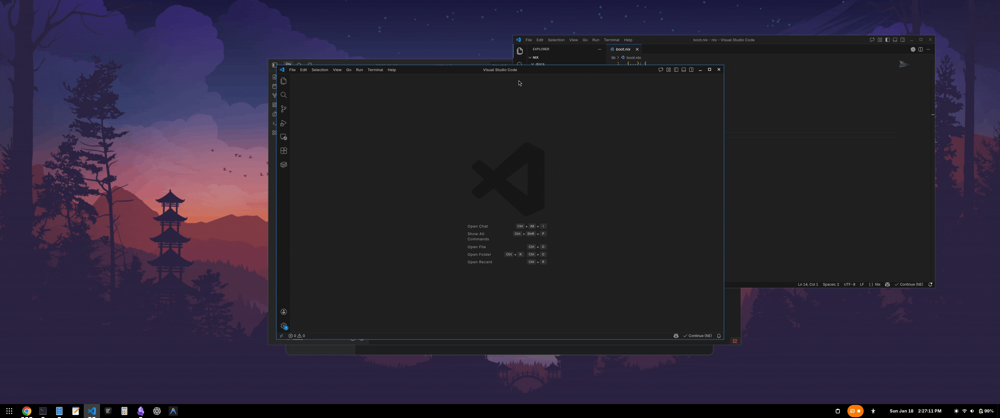

# p7 Commands

Sensible keyboard shortcuts with a small set of Mutter-aware commands to make
the GNOME shell experience more intuitive for power users.

- Compatibility: GNOME Shell 48+.
- Best effort compatibility: GNOME Shell 45+.
- Extension Store: https://extensions.gnome.org/extension/9065/p7-commands/
- Project is also a Nix flake for direct install on NixOS.

## Screencasts

<p align="center">
  
  <br/>
   Window auto optimal size (based on output size): `Super` + `x`
</p>

<p align="center">
  
  <br/>
   Window auto resize on mouse move: `Super` + `Shift` + `x`
</p>

## Commands

### win_optsize

Resizes the focused window to an optimal size for the current monitor work area
and centers it. It cycles through configured scales, and the final step restores
the original window size.

Default keybinding: `<Super>x`

#### Notes

- Currently, GNOME is buggy with multiple monitors, and it often misplaces
  windows out of bounds or at extremely large sizes. This can quickly help bring
  those windows into an optimal size.

### win_mouseresize

Resizes the focused window using the mouse by locking to the nearest edge once
you move the cursor past it, then dragging to the target size.

- Default keybinding: `<Super><Shift>x`
- Press and hold Super + Shift and move mouse to resize.

#### Notes

- This brings Sway like mouse resize behavior to GNOME shell.

## Install

For a local install:

```sh
nix develop
make ginstall

Log out, login again and enable.
```

## Configuration

Configuration is stored in a single GSettings schema
`org.gnome.shell.extensions.p7-cmds`.

### Preferences UI

Open the extension preferences to:

- Add/remove keybindings for each command.
- Edit win_optsize breakpoints and scales, or edit the JSON directly.

### win_optsize JSON

Key: `win-optsize-config`

Example (defaults):

```json
{
  "scales": [
    [0.8, null],
    [0.7, 0.8],
    [0.6, 0.8]
  ],
  "breakpoints": [
    {
      "maxWidth": 1920,
      "scales": [[0.8, null]]
    },
    {
      "maxWidth": 2560,
      "scales": [
        [0.8, 0.8],
        [0.7, 0.8]
      ]
    }
  ]
}
```

Notes:

- `scales` applies when no breakpoint matches.
- Each scale is `[widthScale, heightScale]`. Use `null` for auto height based on
  the monitor aspect ratio.
- Optional `aspectBasedInversion: true` will swap width/height scales on
  portrait screens.

## Development

Common tasks (see `Makefile`):

Useful Make targets:

- `make lint` - run linters
- `make fmt` - run formatters
- `make schemas` - compile GSettings schema
- `make pack` - build zip into `dist/`
- `make ginstall` - build and install using `gnome-extensions`
- `make install` - Manually install into `DESTDIR` dir
- `make enable` / `make disable` / `make reload`
- `make clean`

## License

See `LICENSE`.
